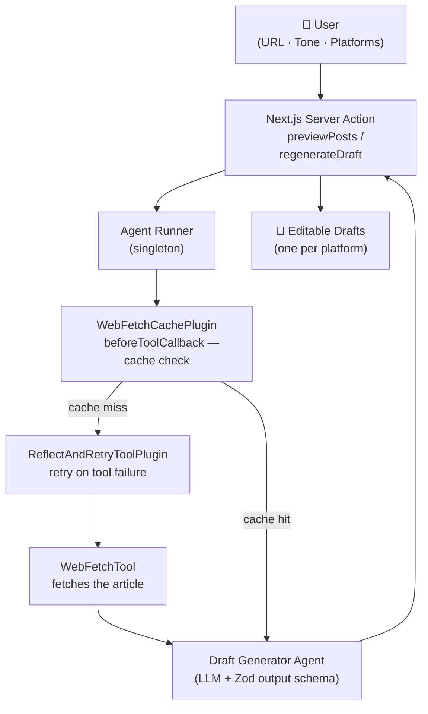

<div align="center">
  
  <br/>
  <h1>The Draft Desk</h1>
  <b>Demo project for the article "How to extend TypeScript AI agents with plugins and callbacks in ADK-TS"</b>
  <br/>
  <i>Next.js · ADK-TS · Plugins · Lifecycle Callbacks · Server Actions</i>
</div>

---

This is the code demo for the article on the IQ blog:

- [How to extend TypeScript AI agents with plugins and callbacks in ADK-TS](https://blog.iqai.com/how-to-extend-typescript-ai-agents-with-plugins-and-callbacks-in-adk-ts/)

> **Branch guide:**
>
> - **`starter`** — UI complete, agent stubs in place — start here when following the article
> - **`final`** — Complete implementation: cache plugin, retry plugin, and action-boundary error handling

Please give this repo a ⭐ if it was helpful to you!

## Table of Contents

- [Overview](#overview)
- [Features](#features)
- [Architecture](#architecture)
- [Technologies Used](#technologies-used)
- [Prerequisites](#prerequisites)
- [Getting Started](#getting-started)
- [Usage](#usage)
- [License](#license)
- [Additional Resources](#additional-resources)

## Overview

The Draft Desk turns a blog post URL into platform-tailored social media drafts for LinkedIn, X, and Threads. It's a small Next.js app, but the focus isn't the app itself — it's the three ADK-TS patterns it demonstrates:

1. **A custom TypeScript plugin** using `beforeToolCallback` and `afterToolCallback` to cache article fetches by URL — so "Rewrite" doesn't re-download the article every time.
2. **Plugin composition** with ADK-TS's built-in `ReflectAndRetryToolPlugin` stacked on top to handle transient tool failures automatically.
3. **Action-boundary error handling** that catches model-level failures (503s, rate limits, schema violations) and surfaces clean messages to the user.

## Features

- **AI-generated drafts** for LinkedIn, X, and Threads from any blog URL
- **Thread mode** for X and Threads — chained 2–10 post threads with per-post character counts
- **Tone selection** — auto, professional, casual, educational, or punchy
- **Per-card Rewrite** — regenerate a single platform's draft without re-fetching the article
- **Custom cache plugin** built with ADK-TS lifecycle callbacks
- **Retry plugin** via `ReflectAndRetryToolPlugin` for flaky fetches
- **User-friendly error messages** normalized at the Server Action boundary
- **Local history sidebar** — recently generated articles saved in `localStorage`
- **Type-safe** with TypeScript and Zod output schema validation

## Architecture



The runner is a singleton — the plugin cache survives across Server Action calls for the lifetime of the Node process.

## Technologies Used

- **[ADK-TS](https://adk.iqai.com/)** – TypeScript framework for building AI agents
- **[Next.js](https://nextjs.org/)** – React framework with Server Actions
- **[Zod](https://zod.dev/)** – Schema validation for structured agent output
- **[Tailwind CSS v4](https://tailwindcss.com/)** – Utility-first styling
- **[Google AI (Gemini)](https://aistudio.google.com/)** – LLM provider

## Prerequisites

- Node.js 22+ — [Download Node.js](https://nodejs.org/en/download/)
- pnpm — [Install pnpm](https://pnpm.io/installation)
- A [Google AI Studio](https://aistudio.google.com/app/api-keys) API key

## Getting Started

1. Clone the repository and switch to the starter branch:

   ```bash
   git clone https://github.com/IQAIcom/adk-ts-samples.git
   cd adk-ts-samples/apps/social-media-drafting-agent
   git checkout starter
   ```

2. Install dependencies:

   ```bash
   pnpm install
   ```

3. Set up environment variables:

   ```bash
   cp .env.example .env
   ```

   Add your API key to `.env`:

   ```env
   GOOGLE_API_KEY=your_google_api_key_here
   LLM_MODEL=gemini-2.5-flash
   ```

4. Start the dev server:

   ```bash
   pnpm dev
   ```

   Open [http://localhost:3000](http://localhost:3000). The UI loads, but clicking **Draft** throws "Not implemented yet" — that's your cue. Follow the article to build the agent layer step by step.

   The finished implementation is in the [`final`](https://github.com/IQAIcom/social-media-drafting-agent/tree/final) branch if you want to check your work.

## Usage

Paste any publicly accessible blog URL into the form, choose a tone and platforms, then click **Draft**. The agent fetches the article and generates one draft per selected platform.

After the first generation, clicking **Rewrite** on any card uses the cached article — no re-download, near-instant response.

For X and Threads you can switch between **Post** (single post) and **Thread** (2–10 chained posts) using the format selector.

## License

MIT — see [LICENSE](../../LICENSE).

## Additional Resources

- 📝 [Article: How to extend TypeScript AI agents with plugins and callbacks in ADK-TS](https://blog.iqai.com/how-to-extend-typescript-ai-agents-with-plugins-and-callbacks-in-adk-ts/)
- 📝 [How to Build Your First AI Agent in TypeScript with ADK-TS](https://blog.iqai.com/build-ai-agent-in-typescript-with-adk-ts/)
- 📚 [ADK-TS Documentation](https://adk.iqai.com/)
- 🔌 [Plugins Reference](https://adk.iqai.com/docs/framework/plugins)
- 🛠️ [Built-in Tools Reference](https://adk.iqai.com/docs/framework/tools/built-in-tools)
- 💻 [ADK-TS GitHub Repository](https://github.com/IQAICOM/adk-ts)
- 📋 [Explore ADK-TS Samples](https://github.com/IQAIcom/adk-ts-samples)
