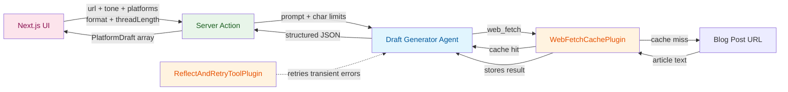

<div align="center">
  
  <br/>
  <h1>The Draft Desk</h1>
  <b>A single-agent blog-to-social drafter with plugin-powered caching and retries, built on the <code>ADK-TS</code> framework.</b>
  <br/>
  <i>Single-Agent • Built-in Tools • Lifecycle Plugins • Structured Output • Next.js • TypeScript</i>
</div>

---

A copy-first drafting assistant built as a **single LlmAgent** with ADK-TS's built-in
`WebFetchTool`, two lifecycle plugins, and a Zod output schema. Paste any blog post URL and the
agent reads the article, then writes platform-tailored drafts for **LinkedIn, X, and Threads**
in the tone you pick. X and Threads can also be drafted as chained threads of 2–10 posts. The UI
lets you edit, regenerate, and copy each draft.

## Features

- **Single LlmAgent + built-in WebFetchTool**: No custom HTML parsing — ADK-TS fetches and
  cleans the article
- **Per-URL cache plugin**: A custom `BasePlugin` uses `beforeToolCallback` and
  `afterToolCallback` to short-circuit repeat `web_fetch` calls with a 1-hour TTL — regenerating
  a draft never re-downloads the article
- **Reflect-and-retry plugin**: ADK-TS's built-in `ReflectAndRetryToolPlugin` auto-retries
  flaky blog fetches with bounded backoff
- **Structured JSON output**: `withOutputSchema` gives the server action a strongly-typed
  response — zero manual JSON parsing
- **Post or thread mode**: X and Threads support single posts or chained threads (2–10 posts,
  default 4); LinkedIn is always a single post
- **Explicit char limits in prompts**: Hard limits are injected directly into the prompt per
  platform — the agent never guesses
- **Next.js Server Actions**: Typed RPC between the React client and the agent runner — no
  API routes, no manual `fetch`
- **Singleton agent runner**: The agent is initialized once per process and reused across
  requests, so the cache plugin persists
- **Tone selection**: Auto, professional, casual, educational, or punchy — applied across all
  drafts
- **Per-segment char counter**: For threads, each segment has its own live counter against the
  platform's per-post limit
- **Regenerate per draft**: Re-roll a single platform's draft without touching the others;
  cache keeps it fast
- **Local history**: Last 10 articles saved to `localStorage`, restorable with one click
- **Editorial UI**: Pure Tailwind v4 with a paper-feel theme and serif display type — no
  component library, no Tailwind plugins

## Architecture and Workflow

This project demonstrates the **single LlmAgent with plugins and structured output** pattern
in ADK-TS — one agent equipped with a built-in tool, two plugin hooks, and a Zod schema. The
agent handles fetching and generation in one shot, and its output is typed end-to-end.

### How It Works

| Piece                         | Role                                                                              |
| ----------------------------- | --------------------------------------------------------------------------------- |
| **Draft Generator Agent**     | Fetches the article via `web_fetch`, writes one draft per selected platform       |
| **WebFetchCachePlugin**       | Intercepts `web_fetch` — short-circuits on cache hit, stores result on miss       |
| **ReflectAndRetryToolPlugin** | Auto-retries transient fetch failures (timeouts, network errors) up to 2 times    |
| **Server Actions**            | `previewPosts` (all platforms) and `regenerateDraft` (one platform)               |
| **Next.js UI**                | Form for URL + tone + platforms + format; editable draft articles; archive sidebar |

### Data Flow



### Project Structure

```text
src/
├── agents/
│   └── draft-generator/
│       ├── agent.ts                  # LlmAgent + WebFetchTool + plugins + Zod schema
│       └── web-fetch-cache-plugin.ts # Per-URL cache via before/afterToolCallback
├── app/
│   ├── actions.ts                    # Server actions: previewPosts, regenerateDraft
│   ├── globals.css                   # Tailwind v4 + editorial theme tokens
│   ├── layout.tsx
│   └── page.tsx                      # Entry point — composes Hero + Drafter
├── components/
│   ├── drafter.tsx                   # Main UI (form, draft articles, archive sidebar)
│   ├── hero.tsx                      # Landing hero
│   └── navbar.tsx                    # Top navbar
├── types.ts                          # Platform / PostFormat / PlatformDraft
└── env.ts                            # Environment schema (zod-validated)
```

## Getting Started

### Prerequisites

- **Node.js 22+** — [Download Node.js](https://nodejs.org/en/download/)
- **Google AI Studio API key** — [Get a key](https://aistudio.google.com/app/api-keys)
- **pnpm** — [Install pnpm](https://pnpm.io/installation)

### Installation

1. Clone this repository

```bash
git clone https://github.com/IQAIcom/adk-ts-samples.git
cd adk-ts-samples/apps/social-media-drafting-agent
```

1. Install dependencies

```bash
pnpm install
```

1. Set up environment variables

```bash
cp .env.example .env
```

Edit `.env` and add your API key:

```env
GOOGLE_API_KEY=your_google_api_key_here
LLM_MODEL=gemini-2.5-flash
```

### Running the App

```bash
# Start the dev server with Turbopack
pnpm dev
```

Open [http://localhost:3000](http://localhost:3000) in your browser.

## Usage

Paste a blog URL, pick a voice, choose your platforms, optionally switch X/Threads to
**Thread** mode with a length of 2–10, then click **Draft**.

```text
Blog URL:   https://your-blog.com/post-slug
Voice:      Auto
For:        LinkedIn, X, Threads
As:         Thread (4 posts)

>> Draft →

Server action runs:
  1. Calls the draft generator runner (singleton — plugins persist)
  2. Agent invokes web_fetch (cache miss) → fetches and stores
  3. Agent returns structured JSON with one draft per platform
  4. UI renders editable articles

==================================================
  Drafts for: "Your article title"
==================================================

[ LinkedIn ] single post                  2,471 / 3,000
  Polished, authoritative take with a clear hook...

[ X ] thread · 4 posts                      268 / 280   (max segment)
  1/4  The hook post — punchy opener.
  2/4  Expand on point one.
  3/4  Drop the stat or example.
  4/4  Wrap with a CTA. Full post ↓

[ Threads ] single post                     421 / 500
  Hey folks — quick thought on this piece...
```

Each draft has **Copy** (appends the URL for single posts; appends the URL to the final
segment for threads) and **Rewrite** (regenerates that draft only — the cache keeps it fast).
The archive sidebar stores your last 10 articles in `localStorage` for one-click restore.

## Real-World Use Cases

The **read → draft per surface** pattern in this project applies anywhere you need consistent
content across multiple surfaces with different length and voice constraints. Here are examples
of what you can build by extending this agent:

### Developer Advocacy

A DevRel team publishes a technical blog post and needs to announce it on LinkedIn
(professional long-form), X (punchy hook + thread), and Threads (conversational community
voice) — each with different character budgets and tonal expectations. Swap the tone
presets for your brand voice and ship announcements in one pass.

### Newsletter Repurposing

Feed in a newsletter issue or long-form post. Get back platform-tailored drafts you can paste
directly into each network without re-reading the full piece or manually cutting it down. Add
more platforms (Bluesky, Mastodon, Substack Notes) by extending the `Platform` union.

### Solo Creators & Indie Hackers

Indie makers launching a product announcement can generate all their platform posts from a
single changelog or launch-day blog post — without burning 45 minutes on copywriting. Switch X
to thread mode for a 6-post launch teardown.

### How to Adapt This Pattern

The single-agent + plugins + structured output pattern generalizes to any domain that needs
to gather content from a source and produce it for several output surfaces:

| What to Customize        | How                                                                    | Example                                                        |
| ------------------------ | ---------------------------------------------------------------------- | -------------------------------------------------------------- |
| **Input tool**           | Swap `WebFetchTool` for another ADK-TS tool                            | Use `WebSearchTool` to take a topic instead of a URL           |
| **Output surfaces**      | Extend `Platform` in `src/types.ts` + update `PLATFORM_SPECS`          | Add Bluesky, Mastodon, Substack Notes, email subject + body    |
| **Cache policy**         | Tune `WebFetchCachePlugin` TTL or key strategy                         | Longer TTL for static content; cache by domain for rate limits |
| **Retry policy**         | Configure `ReflectAndRetryToolPlugin` params                           | Raise `maxRetries` for flakier sources                         |
| **Quality gate**         | Add a reviewer agent that critiques and revises before returning       | Insert a sub-agent that enforces brand voice                   |
| **Publishing**           | Plug in a social-posting MCP server and wire a "Publish" button        | Each platform tool becomes available to a publisher agent      |
| **Scheduling**           | Pair with a cron route or queue (BullMQ, Inngest) to publish on a delay | Draft now, ship at 9am tomorrow                                |

## Useful Resources

### ADK-TS Framework

- [ADK-TS Documentation](https://adk.iqai.com/)
- [Built-in Tools Reference](https://adk.iqai.com/docs/framework/tools/built-in-tools)
- [Plugins Reference](https://adk.iqai.com/docs/framework/plugins)
- [ADK-TS Samples Repository](https://github.com/IQAIcom/adk-ts-samples)
- [ADK-TS GitHub Repository](https://github.com/IQAICOM/adk-ts)

### Next.js

- [Next.js Docs](https://nextjs.org/docs)
- [Server Actions](https://nextjs.org/docs/app/building-your-application/data-fetching/server-actions-and-mutations)

### APIs & Services

- [Google AI Studio Keys](https://aistudio.google.com/app/api-keys)
- [Google Gemini Models](https://ai.google.dev/gemini-api/docs/models/gemini)

### Community

- [ADK-TS Discussions](https://github.com/IQAIcom/adk-ts/discussions)
- [ADK-TS Builders Community](https://t.me/+Z37x8uf6DLE3ZTQ8)
- [IQ AI Community](https://t.me/IQAICOM)

## Contributing

The Draft Desk is part of the [ADK-TS Samples](https://github.com/IQAIcom/adk-ts-samples)
repository, a collection of example projects demonstrating ADK-TS capabilities.

We welcome contributions to the ADK-TS Samples repository! You can:

- **Add new sample projects** showcasing different ADK-TS features
- **Improve existing samples** with better documentation, new features, or optimizations
- **Fix bugs** in current implementations
- **Update dependencies** and keep samples current

Please see our [Contributing Guide](../../CONTRIBUTING.md) for detailed guidelines.

## License

This project is licensed under the MIT License — see the [LICENSE](../../LICENSE) file for details.

---

**🎉 Ready to draft?** This project showcases how a single LlmAgent with one built-in tool,
two plugin hooks, and a Zod output schema can replace hundreds of lines of custom code. Clone
it, swap the platforms, add your own plugins, and ship your own multi-surface content agent.
