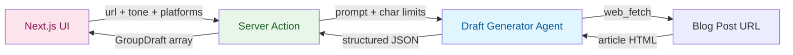

<div align="center">
  
  <br/>
  <h1>Social Media Drafting Agent</h1>
  <b>Turn blog posts into platform-optimized social media drafts using the <code>ADK-TS</code> framework.</b>
  <br/>
  <i>Single-Agent • Tool-Based • Structured Output • Next.js • TypeScript</i>
</div>

---

A copy-first drafting assistant built as a **single LlmAgent** with ADK-TS's built-in
`WebFetchTool` and a structured output schema. Paste any blog post URL and it reads the article,
then writes platform-tailored drafts for **LinkedIn, X, Bluesky, Threads, and Mastodon** in the
tone you pick. The UI lets you edit, regenerate, and copy each draft.

## Features

- **Built-in WebFetchTool**: Uses ADK-TS's out-of-the-box web fetcher — no custom HTML parsing
  code
- **Structured JSON Output**: `withOutputSchema` gives the server action a strongly-typed response
  with zero parsing
- **Group-Based Drafting**: Five platforms collapse into three writing archetypes. The agent writes
  one draft per group, capping LLM cost at 3 generations regardless of selection
- **Explicit Char Limits in Prompts**: Hard limits are passed directly in the prompt — the agent
  never guesses
- **Next.js Server Actions**: Typed RPC between the React client and the agent runner — no API
  routes, no manual `fetch`
- **Singleton Agent Runner**: The agent is initialized once per process and reused across requests
- **Tone Selection**: Auto, professional, casual, educational, or punchy — applied across all
  drafts
- **Live Char Counter**: UI shows per-draft character count against the group's hard limit, with
  overflow highlighting
- **Regenerate Per Draft**: Re-roll a single draft without touching the others
- **Local History**: Last 10 articles saved to `localStorage`, restorable with one click

## Architecture and Workflow

This project demonstrates the **single-agent with structured output** pattern in ADK-TS — one
`LlmAgent` equipped with a built-in tool and a Zod schema. The agent handles fetching and
generation in one shot, and its output is typed end-to-end.

### Platform Groups

The five platforms are bucketed into three writing archetypes. The agent writes one draft per
group, and the same draft is shown for every platform in that group.

| Group                | Platforms          | Char Limit | Writing Style                                 |
| -------------------- | ------------------ | ---------- | --------------------------------------------- |
| `short-casual`       | X, Bluesky         | 280        | Punchy hook, casual voice, 2-3 hashtags       |
| `medium-community`   | Threads, Mastodon  | 500        | Conversational, community-friendly            |
| `long-professional`  | LinkedIn           | 3000       | Polished, authoritative, clear takeaway       |

Worst case: **3 LLM drafts regardless of how many platforms the user picks.**

### Data Flow



### Project Structure

```text
src/
├── agents/
│   └── draft-generator/
│       └── agent.ts              # LlmAgent with WebFetchTool + withOutputSchema
├── app/
│   ├── actions.ts                # Server actions: previewPosts, regenerateDraft
│   ├── layout.tsx
│   ├── page.tsx                  # Entry point — composes Hero + Drafter
│   └── globals.css
├── components/
│   ├── drafter.tsx               # Main UI (form, draft cards, history)
│   ├── hero.tsx                  # Landing hero
│   ├── navbar.tsx                # Top navbar
│   └── ui/                       # shadcn primitives (button, card, textarea)
├── lib/
│   └── utils.ts                  # cn() utility
├── types.ts                      # Platform / PlatformGroup / GroupDraft
└── env.ts                        # Environment schema (zod-validated)
```

## Getting Started

### Prerequisites

- **Node.js 22+** — [Download Node.js](https://nodejs.org/en/download/)
- **Google AI Studio API key** — [Get a key](https://aistudio.google.com/app/api-keys)
- **pnpm** — [Install pnpm](https://pnpm.io/installation)

### Installation

1. Clone this repository

   ```bash
   git clone https://github.com/IQAIcom/adk-ts-samples.git
   cd adk-ts-samples/apps/social-media-assistant
   ```

1. Install dependencies

   ```bash
   pnpm install
   ```

1. Set up environment variables

   ```bash
   cp .env.example .env
   ```

Edit `.env` and add your API key:

```env
GOOGLE_API_KEY=your_google_api_key_here
LLM_MODEL=gemini-2.5-flash
```

### Running the App

```bash
# Start the dev server with Turbopack
pnpm dev
```

Open [http://localhost:3000](http://localhost:3000) in your browser.

## Usage

Paste a blog URL, pick a tone, toggle the platforms you care about, and click **Generate drafts**.

```text
URL:       https://your-blog.com/post-slug
Tone:      Auto
Platforms: LinkedIn, X, Bluesky, Threads, Mastodon

>> Generate drafts

Server action runs:
  1. Calls the draft generator runner
  2. Agent invokes web_fetch to read the article
  3. Agent returns structured JSON with 3 group drafts
  4. UI renders 3 editable cards — one per group

==================================================
  Drafts for: "Your article title"
==================================================

[ Long-form professional ]        2471 / 3000
  For: LinkedIn
  Great for long-form takes...

[ Medium community ]               398 / 500
  For: Threads, Mastodon
  Hey folks — quick thought...

[ Short & casual ]                 246 / 280
  For: X, Bluesky
  Quick hot take with a hook...
```

Each card has **Copy**, **Regenerate**, and is fully editable inline.

## Real-World Use Cases

The **read → group → draft** pattern in this project applies anywhere you need consistent content
across multiple surfaces with different length and voice constraints. Examples:

### Developer Advocacy

A DevRel team publishes a technical blog post and needs to announce it on LinkedIn (professional),
X (punchy), Bluesky (casual dev community), Threads (conversational), and Mastodon (federated
tech community) — each with different character budgets and tonal expectations.

### Content Repurposing for Newsletter Writers

Feed in a newsletter issue or long-form post. Get back three drafts you can paste into your social
tabs without re-reading the full piece or manually cutting it down.

### Solo Creators & Indie Hackers

Indie makers launching a product announcement can generate all five platform posts from a single
changelog or blog post without burning 45 minutes on copywriting.

### How to Adapt This Pattern

The group-based drafting pattern generalizes beyond social media. You can swap the platform list
for any set of output surfaces with shared writing archetypes:

| Domain             | Groups                                | Shared Constraint                                     |
| ------------------ | ------------------------------------- | ----------------------------------------------------- |
| Email marketing    | Subject line / preview / body         | Tone consistency, length ladder                       |
| Product updates    | Changelog / release notes / tweet     | Audience: developers vs. users vs. general public     |
| Sales outreach     | Cold email / LinkedIn DM / follow-up  | Same value prop, different formality levels           |
| Internal comms     | All-hands / team email / Slack post   | Same announcement, different audience depth           |

You can also:

- **Add more platforms** — update `PLATFORM_GROUPS` in `src/types.ts` and the agent instruction
- **Swap `WebFetchTool`** for `WebSearchTool` if your input is a topic instead of a URL
- **Add a reviewer agent** — insert a second agent that critiques and revises drafts before
  returning them
- **Auto-post via MCP** — plug in a social-posting MCP server (e.g.
  [`social-mcp`](https://www.npmjs.com/package/social-mcp)) and wire a "Publish" button to a
  publisher agent. Each platform tool becomes available to the agent as soon as its credentials
  are set
- **Schedule posts** — pair the drafter with a scheduler (cron job, Next.js cron route, or a
  queue like BullMQ) so drafts are stored and published at chosen times. Combine with MCP
  auto-posting for full hands-off publishing

## Useful Resources

### ADK-TS Framework

- [ADK-TS Documentation](https://adk.iqai.com/)
- [Built-in Tools Reference](https://adk.iqai.com/docs/framework/tools/built-in-tools)
- [ADK-TS Samples Repository](https://github.com/IQAIcom/adk-ts-samples)
- [ADK-TS GitHub Repository](https://github.com/IQAICOM/adk-ts)

### Next.js

- [Next.js Docs](https://nextjs.org/docs)
- [Server Actions](https://nextjs.org/docs/app/building-your-application/data-fetching/server-actions-and-mutations)

### APIs & Services

- [Google AI Studio Keys](https://aistudio.google.com/app/api-keys)
- [Google Gemini Models](https://ai.google.dev/gemini-api/docs/models/gemini)

### Community

- [ADK-TS Discussions](https://github.com/IQAIcom/adk-ts/discussions)
- [ADK-TS Builders Community](https://t.me/+Z37x8uf6DLE3ZTQ8)
- [IQ AI Community](https://t.me/IQAICOM)

## Contributing

This Social Media Drafting Agent is part of the
[ADK-TS Samples](https://github.com/IQAIcom/adk-ts-samples) repository, a collection of example
projects demonstrating ADK-TS capabilities.

We welcome contributions to the ADK-TS Samples repository! You can:

- **Add new sample projects** showcasing different ADK-TS features
- **Improve existing samples** with better documentation, new features, or optimizations
- **Fix bugs** in current implementations
- **Update dependencies** and keep samples current

Please see our [Contributing Guide](../../CONTRIBUTING.md) for detailed guidelines.

## License

This project is licensed under the MIT License — see the [LICENSE](../../LICENSE) file for details.

---

**Ready to draft?** This project showcases how a single LlmAgent with one built-in tool and a
Zod output schema can replace hundreds of lines of custom code. Clone it, swap the platforms, and
ship your own multi-surface content agent.
